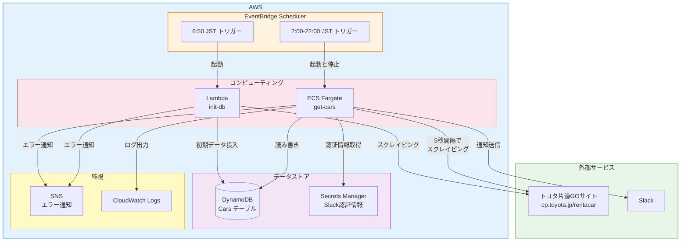
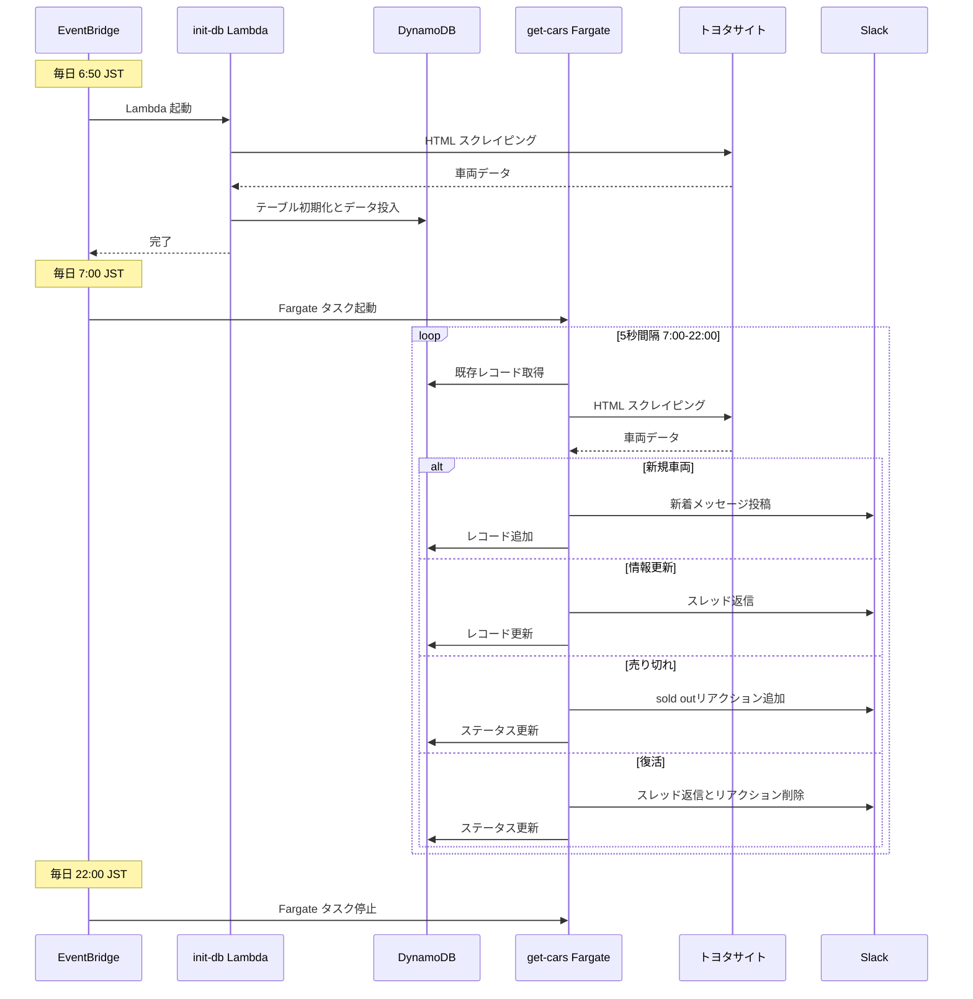
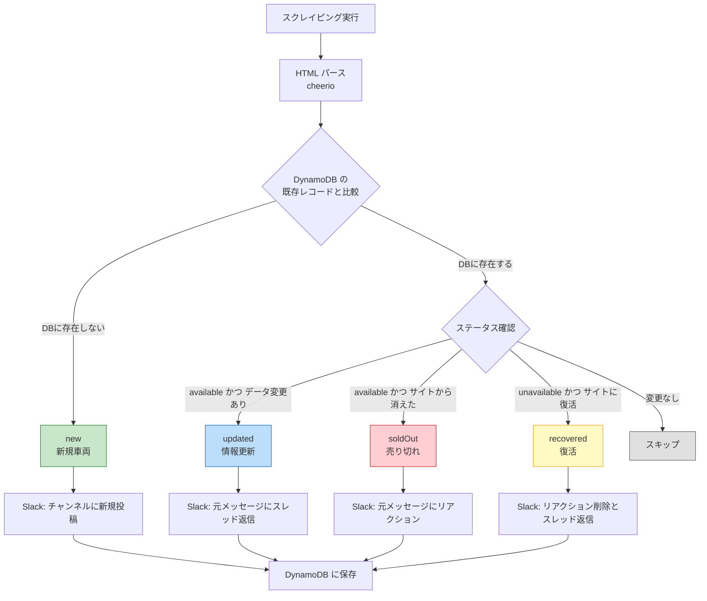
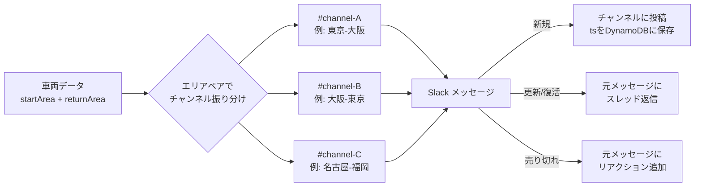
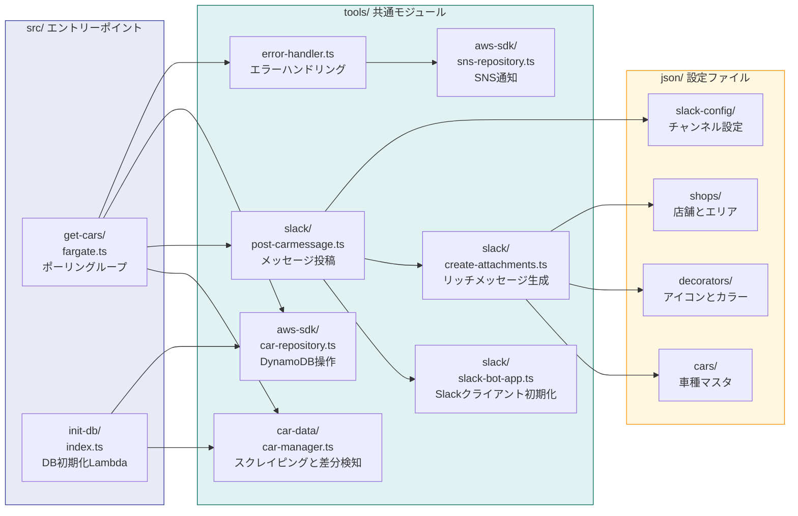

# katamichi-go-bot-neo アーキテクチャ

トヨタレンタカーの「片道GO」サイトを定期的にスクレイピングし、車両の空き状況の変化を Slack に通知するシステム。

---

## システム全体像

---

## 1日の処理フロー

---

## 変更検知ロジック

---

## Slack チャンネルルーティング

---

## ソースコード構成

---

## 技術スタック

| カテゴリ | 技術 |
|---------|------|
| 言語 | TypeScript (ESM) |
| ランタイム | Node.js |
| ビルド | esbuild |
| テスト | vitest |
| リンター | Biome |
| スクレイピング | cheerio |
| Slack連携 | @slack/bolt |
| AWS SDK | @aws-sdk v3 (DynamoDB, SNS) |
| コンテナ | Docker (Fargate + Lambda) |
| IaC | Terraform |
| CI/CD | GitHub Actions (OIDC認証) |
